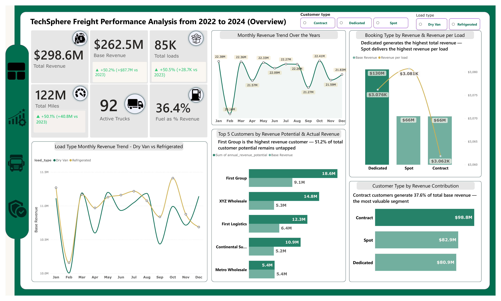
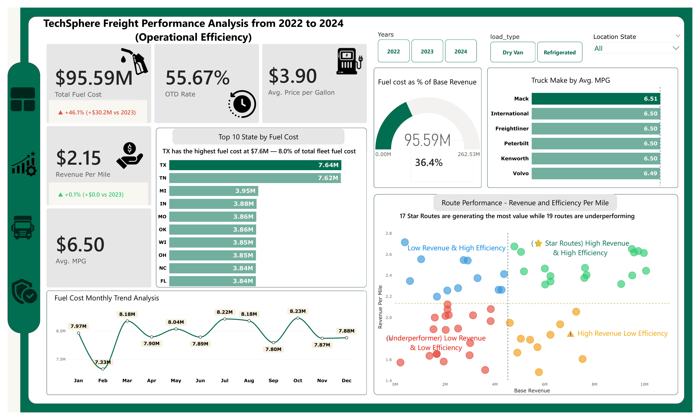
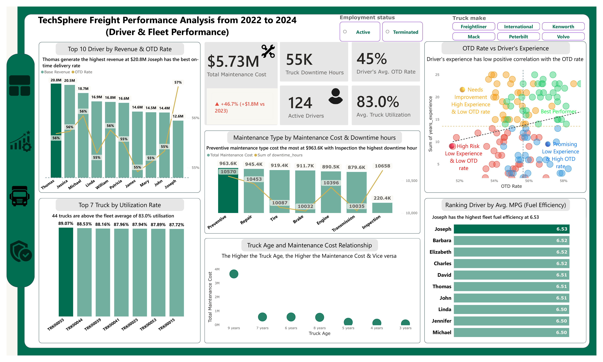
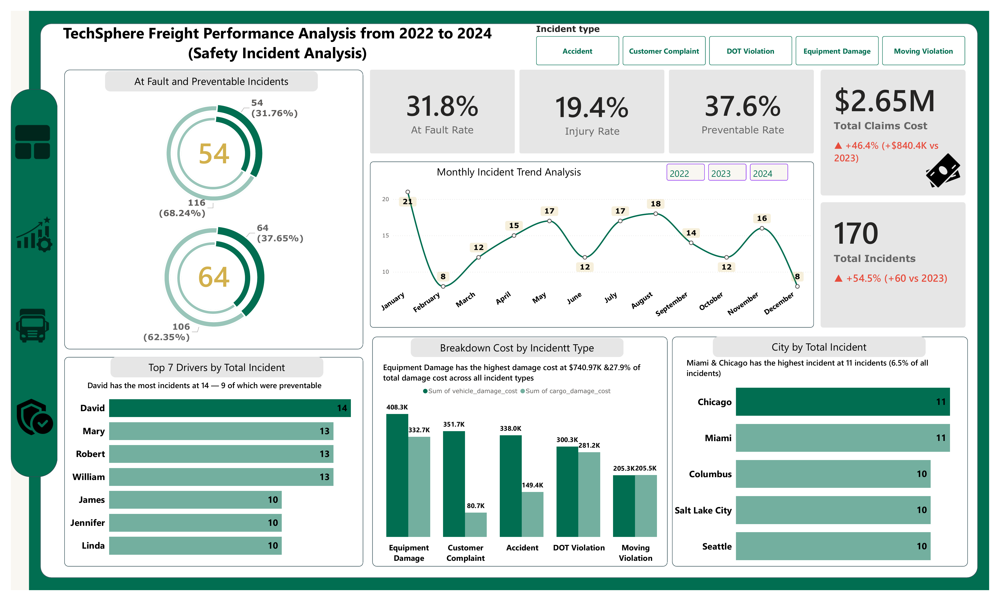

# TechSphere Freight Performance Analysis (2022–2024)
### TS Academy Capstone Project | Built with Microsoft Power BI

---

## 📌 Project Overview

TechSphere Freight is a large-scale logistics company operating a fleet of **92 active trucks** and **124 active drivers** delivering freight across the United States through a network of routes connecting major commercial hubs. Over three years — 2022 to 2024 — the company processed **85,000+ loads** generating **$298.6 million in total revenue** ($262.5M in base revenue).

Despite this impressive commercial scale, leadership lacked integrated visibility into the four operational pillars that determine long-term profitability: **fuel efficiency, route performance, driver productivity and safety risk management.** This capstone project delivers a four-page interactive Power BI dashboard that connects all operational data sources into one unified analytical system — built to answer the questions that actually drive business decisions.

---

## ❓ Business Problem

> *"TechSphere Freight is generating $298.6M in total revenue across 85,000+ loads — but faces critical operational blind spots that are silently eroding profitability. Fuel alone consumes 36.4% of every revenue dollar. On-time delivery rates sit at only 55.67%, meaning nearly 1 in every 2 deliveries arrives late. Maintenance costs have surged 46.7% year-over-year. Safety claims have jumped 46.4% to $2.65M. Yet management has no single integrated view of where value is being created and where it is being destroyed. This dashboard was built to change that — connecting revenue, operational efficiency, fleet performance and safety risk into one complete picture so that every major decision from 2025 forward is grounded in data."*

---

## 📊 Dashboard Preview

### Page 1 — Executive Overview


### Page 2 — Operational Efficiency


### Page 3 — Driver & Fleet Performance


### Page 4 — Safety Incident Analysis


---

## 🗂️ Dataset Overview

| Table | Description | Records |
|---|---|---|
| loads | All shipments — revenue, weight, customer, route, booking type | 85,410 |
| trips | Every journey — distance, fuel consumption, duration, MPG | 85,410 |
| drivers | Driver profiles — experience, employment status, license class | 150 |
| driver_monthly_metrics | Monthly KPIs per driver — revenue, MPG, OTD rate, idle hours | 4,464 |
| trucks | Fleet inventory — make, model year, status, home terminal | 120 |
| truck_utilization_metrics | Monthly truck performance — utilisation rate, downtime, miles | 3,312 |
| trailers | Trailer fleet — type, capacity, status | 180 |
| routes | All route lanes — origin, destination, distance, rate per mile | 58 |
| customers | Customer profiles — type, account status, revenue potential | 200 |
| delivery_events | Every pickup and delivery — on-time flag, detention minutes | 170,820 |
| fuel_purchases | Every fuel stop — gallons, price per gallon, state, cost | 196,442 |
| maintenance_records | All maintenance events — type, cost, downtime hours | 2,920 |
| safety_incidents | All incidents — type, fault flag, preventable flag, claims | 170 |
| facilities | Depots and warehouses — location, type, capacity | 50 |

**Total records across all tables: 545,000+**

---

## 🔗 Data Model

```
Date Table ──────────────► loads ──────────► customers
                               │              routes
                               │
                               ▼
                            trips ──────────► drivers
                               │              trucks
                               │              trailers
                               │
              ┌────────────────┼────────────────┐
              ▼                ▼                ▼
    delivery_events    fuel_purchases   safety_incidents

trucks ──► maintenance_records
trucks ──► truck_utilization_metrics
drivers ──► driver_monthly_metrics
```

---

## 🔍 Insight Questions

### Page 1 — Executive Overview
1. Which customer type generates the most revenue — Contract, Spot or Dedicated?
2. Which booking type drives the highest total revenue and which is most efficient per load?
3. How has monthly revenue trended from 2022 to 2024?
4. How do Dry Van and Refrigerated loads compare in monthly revenue performance?
5. Who are the top 5 customers by revenue potential vs actual revenue generated?

### Page 2 — Operational Efficiency
6. Which states have the highest total fuel costs and where should refuelling be optimised?
7. What proportion of base revenue is consumed by fuel costs?
8. How has fuel cost trended month by month across the three-year period?
9. Which truck make delivers the highest average fuel efficiency (MPG)?
10. Which routes generate the highest revenue and which are the most efficient per mile?

### Page 3 — Driver & Fleet Performance
11. Which drivers generate the most revenue and maintain the best on-time delivery rates?
12. Is there a relationship between driver experience and on-time delivery performance?
13. Which trucks have the highest utilisation rates and which are underperforming?
14. Which maintenance type costs the most and causes the most downtime hours?
15. Is there a relationship between truck age and total maintenance cost?
16. Which drivers have the highest fuel efficiency (MPG)?

### Page 4 — Safety Incident Analysis
17. What percentage of incidents are at-fault and what percentage are preventable?
18. Which drivers have been involved in the most incidents and how many were preventable?
19. Which incident type causes the most vehicle and cargo damage cost?
20. Which cities have the highest concentration of safety incidents?
21. How have monthly incident numbers trended across the three years?

---

## 💡 Key Findings

**Finding 1 — The business grew strongly but fuel growth is outpacing revenue**
Total revenue reached $298.6M with base revenue at $262.5M. Base revenue grew **+50.2% (+$87.7M vs 2023)** and total loads grew **+50.5% (+28.7K vs 2023)** — impressive top-line growth. However fuel cost also grew at a comparable rate, meaning revenue growth is not translating proportionally into profit improvement.

**Finding 2 — Contract customers are the most valuable segment**
Contract customers generate **$98.8M** in base revenue — the highest of all three customer types. Spot customers contribute $82.9M and Dedicated $80.9M. Despite being the most valuable, Contract represents **37.6% of total base revenue** — meaning the company is still heavily reliant on lower-commitment Spot and Dedicated relationships.

**Finding 3 — Revenue peaks in September and troughs in February**
The monthly revenue trend line shows clear seasonality with a February low and a September-October peak across both Dry Van and Refrigerated load types. Both load types move almost in parallel — suggesting external market forces rather than product-specific demand are driving the seasonal pattern.

**Finding 4 — Fuel is the single biggest cost leak in the business**
At **$95.59M**, fuel cost represents **36.4% of every base revenue dollar** — the company retains only $0.636 for every dollar it earns before any other cost is considered. This is not a margin problem. It is a structural cost problem that requires both operational and procurement intervention.

**Finding 5 — Texas and Tennessee are the most expensive refuelling states**
TX has the highest fleet fuel spend at **$7.64M** (8.0% of total fleet fuel cost) and TN follows at **$7.62M**. These two states alone account for approximately 16% of total fleet fuel expenditure. MI, IN, MO, OK, WI and OH each contribute between $3.84M and $3.95M. A strategic refuelling optimisation plan targeting the top 5 states could meaningfully reduce per-mile fuel cost.

**Finding 6 — Fuel cost peaks in September at $8.23M per month**
The monthly fuel trend shows a January low of $7.97M, a February trough at $7.33M, recovery through spring and summer, and a September peak at $8.23M. This seasonal fuel spend pattern does not align perfectly with the revenue peak months — suggesting some months see disproportionately high fuel cost relative to revenue generated.

**Finding 7 — Thomas is the highest revenue driver but Joseph has the best on-time rate**
Thomas generates **$20.8M** in base revenue — the highest in the fleet. However Joseph achieves the highest on-time delivery rate at **57%**, outperforming the driver average of **45%**. The most commercially valuable driver and the most reliable driver are not the same person — a critical distinction for performance management.

**Finding 8 — The oldest trucks generate the highest maintenance cost**
The bubble chart confirms a clear positive relationship: **9-year-old trucks generate approximately $4M** in total maintenance cost — significantly higher than 3-year-old trucks at less than $0.5M. The relationship is not perfectly linear but the direction is unambiguous. Older fleet is materially more expensive to operate.

**Finding 9 — Nearly 1 in 3 incidents is at-fault and more than 1 in 3 is preventable**
Of the **170 total incidents**, **54 (31.76%) were at-fault** and **64 (37.65%) were preventable**. The at-fault rate means TransLogix bears direct financial and legal responsibility for roughly a third of all incidents. The preventable rate is even more concerning — 64 incidents that should never have happened cost the business $2.65M in claims.

**Finding 10 — January is the most dangerous month and safety incidents have surged 54.5% year-over-year**
The monthly trend shows January peaking at 21 incidents — the highest month in the dataset. Total incidents grew by **+54.5% (+60 incidents vs 2023)** and total claims grew **+46.4% (+$840.4K vs 2023)**. These are not marginal increases — they represent a safety trajectory that, if unchecked, will continue to compound into increasingly significant financial and human cost.

---

## ✅ Recommendations

### 1. Launch an Immediate Fuel Cost Reduction Programme
At 36.4% of base revenue, fuel is the single largest controllable cost in the business. Three levers should be activated simultaneously: a driver idle-time reduction campaign with individual targets and incentives; a refuelling route optimisation strategy that prioritises lower-cost states and avoids TX and TN peak-price refuelling where possible; and a review of load routing to reduce empty miles which drive fuel cost without generating revenue.

### 2. Unlock the Revenue Potential Gap in the Top Customer Accounts
First Group has $18.6M in annual revenue potential but is delivering only $9.1M — a $9.5M gap. XYZ Wholesale has $14.8M potential against $5.3M actual. These are not new customer acquisition challenges — they are account management failures with existing relationships. A dedicated account growth programme targeting the top 5 customers by potential gap could unlock $20M+ in incremental revenue without a single new customer.

### 3. Convert Spot Booking Efficiency into a Commercial Strategy
Spot bookings deliver the highest revenue per load at $3.081K — higher than both Dedicated ($3.076K) and Contract ($3.062K). Yet the company generates far less total revenue from Spot. A deliberate strategy to grow high-efficiency Spot bookings in peak-demand periods — while using Contract bookings to guarantee baseline volume — would improve revenue quality not just revenue quantity.

### 4. Prioritise the 19 Underperforming Routes for Immediate Review
The route scatter analysis identified 19 routes in the underperforming quadrant — low revenue and low efficiency per mile simultaneously. Each of these routes should be assessed against its operating cost, customer contract terms and strategic value. Routes that cannot be improved should be deprioritised and the freed capacity redirected to the 17 Star Routes where revenue and efficiency are both high.

### 5. Place David and the Top Incident Drivers on Immediate Safety Intervention
David's 14 incidents — 9 of which were preventable — is not a coincidence. It is a pattern. A structured Performance Improvement Plan combining enhanced safety training, route monitoring and regular check-ins should be implemented immediately for the top 5 highest-incident drivers. If the pattern continues without improvement, reassignment or separation should be considered. The financial cost of continued incidents ($15,600 average per claim) far exceeds the cost of intervention.

### 6. Accelerate Fleet Renewal for 8–9 Year Old Trucks
The data is unambiguous — 9-year-old trucks generate approximately $4M in maintenance cost compared to under $0.5M for 3-year-old trucks. A structured fleet renewal schedule prioritising the retirement of the oldest, highest-maintenance trucks would simultaneously reduce maintenance spend, recover downtime hours and improve fleet-wide fuel efficiency. The capital cost of new trucks should be modelled against the total cost of maintaining the current oldest fleet cohort.

### 7. Address the Safety Surge Before It Compounds Further
A 54.5% increase in incidents and a 46.4% increase in claims cost in a single year is a crisis-level signal. The company needs an emergency safety review to understand what changed operationally in 2024 that drove this surge — whether it is new driver cohorts, new routes, increased load pressure or inadequate rest compliance. January (21 incidents) and the Chicago/Miami corridor should be the starting focus of that investigation.


---

## 🛠️ Tools & Technologies

| Tool | Purpose |
|---|---|
| Microsoft Power BI | 4-page interactive dashboard design |
| Power Query | Data cleaning, transformation, type correction |
| DAX | All KPIs, calculated columns, dynamic callout text, YoY indicators |
| Date Table (CALENDAR function) | Time intelligence across 7 date-linked tables |
| Conditional Formatting | YoY color coding, risk labels, utilisation status |
| Scatter Chart Quadrant Analysis | Route and driver performance segmentation |

---

## 🔧 Data Cleaning & Preparation Steps

1. **Null IDs in trips** — Replaced 1,714 null driver_id and 1,672 null truck_id values with "Unassigned" to preserve all trip records without breaking relationships
2. **Null IDs in fuel_purchases** — Replaced 3,880 null truck_id and 3,988 null driver_id values with "Unknown"
3. **Driver termination_date nulls** — Created conditional column: null → "Active", value present → "Terminated"
4. **All date columns stored as text** — Converted load_date, dispatch_date, purchase_date, incident_date and maintenance_date from text to Date type in Power Query
5. **Date Table created** — `CALENDAR(DATE(2022,1,1), DATE(2024,12,31))` with Year, Month Number, Month Name, Quarter, Year Month columns. Marked as Date Table and connected to all 7 fact tables
6. **Truck Age column** — Calculated column: `Truck Age = 2024 - trucks[model_year]`
7. **Driver Full Name** — `Driver Full Name = drivers[first_name] & " " & drivers[last_name]`
8. **Route Performance Category** — Calculated column classifying each route into Star Route, High Revenue Low Efficiency, Efficient Low Volume or Underperformer based on average revenue and revenue per mile thresholds
9. **Driver Performance Category** — Calculated column classifying drivers into Best Performer, Promising, Needs Improvement or High Risk based on OTD rate and years of experience quadrants
10. **Truck Utilisation Status** — Conditional column: ≥80% = High (green), 60–79% = Moderate (amber), <60% = Low (red)

---

## 📐 DAX Measures — Complete List

**Revenue & Commercial**
```
Total Revenue = SUM(loads[revenue]) + SUM(loads[fuel_surcharge]) + SUM(loads[accessorial_charges])
Base Revenue = SUM(loads[revenue])
Revenue Per Load = DIVIDE([Base Revenue], [Total Loads])
Revenue Per Mile = DIVIDE([Base Revenue], [Total Miles])
Active Customers = CALCULATE(COUNTROWS(customers), customers[account_status] = "Active")
```

**Fuel & Efficiency**
```
Total Fuel Cost = SUM(fuel_purchases[total_cost])
Avg MPG = AVERAGE(trips[average_mpg])
Avg Price Per Gallon = AVERAGE(fuel_purchases[price_per_gallon])
Fuel As Pct Revenue = DIVIDE([Total Fuel Cost], [Base Revenue])
Fuel Cost Per Mile = DIVIDE([Total Fuel Cost], [Total Miles])
Net Revenue After Fuel = [Base Revenue] - [Total Fuel Cost]
```

**Delivery & Operations**
```
On Time Delivery Rate = DIVIDE(CALCULATE(COUNTROWS(delivery_events), delivery_events[on_time_flag] = TRUE()), COUNTROWS(delivery_events))
Late Delivery Rate = 1 - [On Time Delivery Rate]
Total Detention Minutes = SUM(delivery_events[detention_minutes])
Avg Detention Minutes = AVERAGE(delivery_events[detention_minutes])
```

**Driver Performance**
```
Driver Total Revenue = SUM(driver_monthly_metrics[total_revenue])
Driver Avg MPG = AVERAGE(driver_monthly_metrics[average_mpg])
Driver Avg OTD Rate = AVERAGE(driver_monthly_metrics[on_time_delivery_rate])
Driver Revenue Per Mile = DIVIDE(SUM(driver_monthly_metrics[total_revenue]), SUM(driver_monthly_metrics[total_miles]))
```

**Fleet & Maintenance**
```
Avg Truck Utilization = AVERAGE(truck_utilization_metrics[utilization_rate])
Truck Total Downtime Hours = SUM(truck_utilization_metrics[downtime_hours])
Total Maintenance Cost = SUM(maintenance_records[total_cost])
Maintenance Cost Per Mile = DIVIDE([Total Maintenance Cost], [Total Miles])
Avg Downtime Per Maintenance Event = AVERAGE(maintenance_records[downtime_hours])
```

**Safety**
```
Total Incidents = COUNTROWS(safety_incidents)
Preventable Incidents = CALCULATE(COUNTROWS(safety_incidents), safety_incidents[preventable_flag] = TRUE())
Preventable Rate = DIVIDE([Preventable Incidents], [Total Incidents])
At Fault Incidents = CALCULATE(COUNTROWS(safety_incidents), safety_incidents[at_fault_flag] = TRUE())
At Fault Rate = DIVIDE([At Fault Incidents], [Total Incidents])
Incidents With Injury = CALCULATE(COUNTROWS(safety_incidents), safety_incidents[injury_flag] = TRUE())
Total Claims Cost = SUM(safety_incidents[claim_amount])
Avg Claim Per Incident = DIVIDE([Total Claims Cost], [Total Incidents])
```

**YoY Time Intelligence (applied to all key KPIs)**
```
[KPI] PY = CALCULATE([KPI], SAMEPERIODLASTYEAR(Date Table[Date]))
[KPI] YoY % = DIVIDE([KPI] - [KPI] PY, [KPI] PY)
[KPI] YoY Text = IF([YoY %] >= 0, "▲ +" , "▼ ") & FORMAT(ABS([YoY %]), "0.0%") & " vs 2023"
[KPI] YoY Color = IF([YoY %] >= 0, "#2ECC71", "#E74C3C")  -- reversed for cost KPIs
```
---
## 🏁 Conclusion

TechSphere Freight is a commercially capable logistics business — $298.6M in total revenue, 85,000+ loads completed and a growing customer base demonstrate genuine operational scale. But the data in this dashboard reveals a consistent pattern: **the business is growing faster than it is improving.**

Revenue grew 50%+ year-over-year. But fuel cost grew at the same pace. Maintenance cost grew 46.7%. Safety claims grew 46.4%. Growth without efficiency improvement is not a sustainable trajectory — and this dashboard exists to make that truth impossible to ignore.

The good news is that every critical problem identified here has a clear and actionable solution. The fuel crisis is addressable through driver behaviour and refuelling strategy. The safety surge is addressable through targeted driver intervention. The customer revenue gap is addressable through account management. The underperforming routes are addressable through network review.

---


## 👤 About the Analyst

**Fatimah Olatunji**
Data Analyst | Business Administration Graduate
Obafemi Awolowo University (OAU)
Documenting every step of my data analytics learning journey publicly

[](www.linkedin.com/in/fatimah-olatunji-7665b73b6)
[](https://twitter.com/ojuolape124)

---

*This capstone project was completed as part of the TS Academy Data Analytics programme. Every element — from 14-table data modelling to 20 dynamic DAX callout measures to four-page navigation design — was built from scratch as a demonstration of end-to-end analytical thinking applied to a real logistics business problem.*
